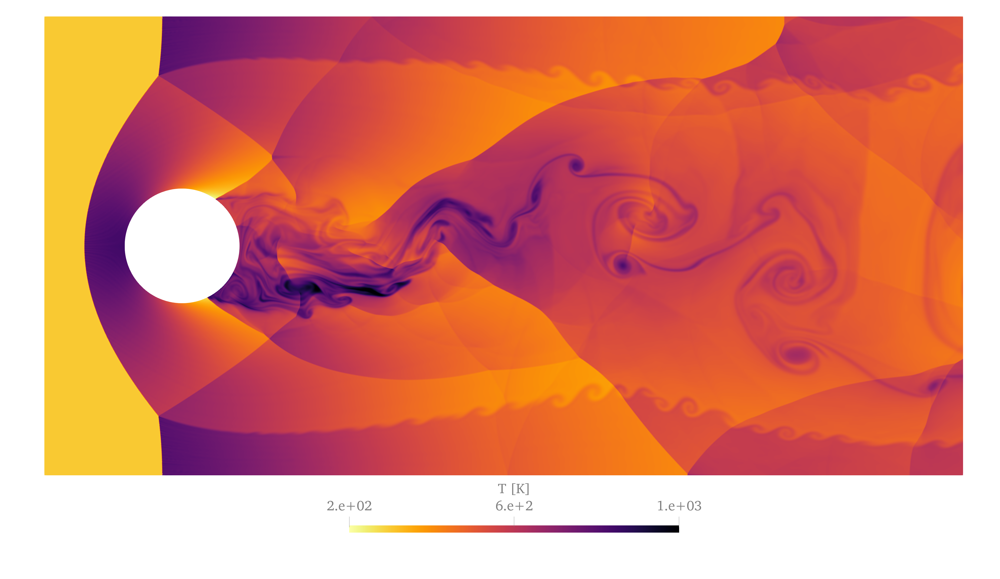
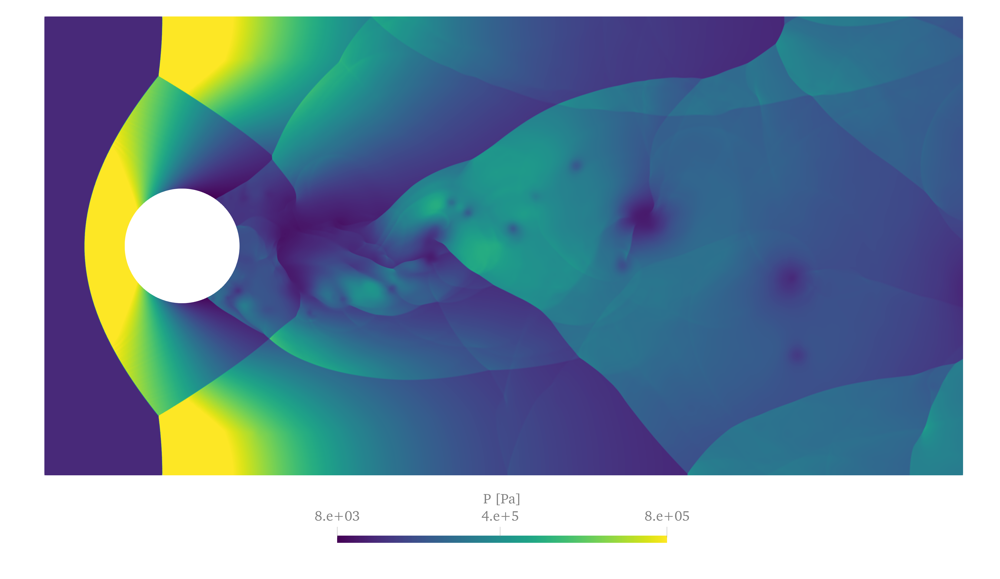
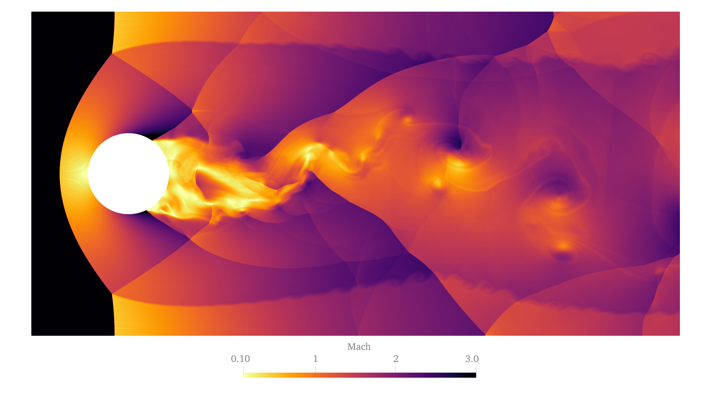

## Supersonic Inviscid Flow past a Cylinder in a Channel

# Geometry, BCs and numerical Setup
Results of an Euler simulation of a Mach 3 flow past a cylinder in a channel. The simulation was performed with the FVM solver of SU2 on a triangulated domain with uniform element size of h=0.0018. The domain consists of a cylinder of radius r=0.25 in a channel of height H=2 and lenght L=4. The cilinder is placed at a distance of a=0.6 from the inlet.

A uniform supersonic flow with Mach = 3, P = 100000 Pa and T = 300 K is imposed at the inlet, while silp boundary consitions are imposed at the top and bottom sides of the domain and on the cylinder. Otlet boundary conditions are imposed at the right end of the domain.

The FVM was used to discretize the 2D Euler equations with the approximate Riemann solver HLLC to compute the convective fluxes. Second order in space accuracy is obtained by linearly extrapolating the primitive variables via a MUSCL scheme. A Venkatakrishnan-Wang slope limiter was employed to avoid spurious oscillations by limiting the primitive variables change. A dual time stepping scheme was used to solve the unsteady Euler equations. A BDF2 scheme was used to discretize the resulting ODE yielding a second order time accurate scheme. At each time step an additional dependency on a pseudo-time is added to reduce the residual and allow for larger time steps. The pseudo-time derivative is discretized via an impicit Euler scheme and solved to steady state using local time-stepping to accelerate convergence. The CFL number used in pseudo-time iteration was set to CFL = 10. The resulting sparse linear system was solved iteratively via the FGMRES solver.

# Transient Results
A Karman-like shedding behaviour develops after a transient phase reported in the animation below. The animation shows a Schlieren-like image of the flow-field obtained by computing the magnitude of the density of the fluid.

# Developed Flow
The following images report the Temperature, Pressure, Mach and Density fields of the developed flow:

